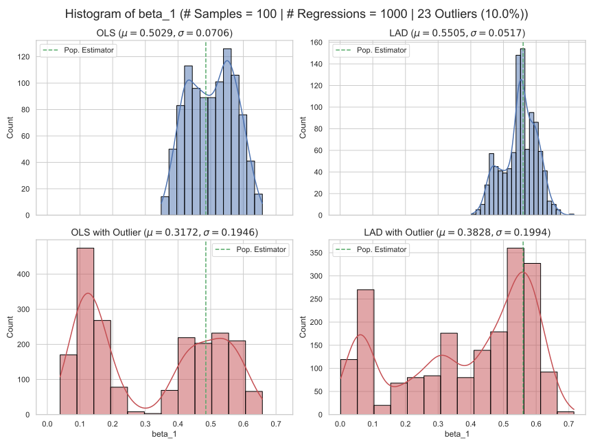

# About the notebook
This notebook contains the bonus exercise of the lecture 'Advanced Statistics' at KIT.  
We analysed the behaviour of the OLS / LAD regression estimators in the presence of outliers.

**Authors**
- Katharina Jacob
- Peter Fabisch
- Alessio Negrini

## Approach
The data set is the [Engel (1857) food expenditure data](https://www.statsmodels.org/dev/datasets/generated/engel.html) that describes the income and food expenditure for N=235 working class households in 1857 Belgium. We first fitted a OLS and LAD regression on this population and after that we added synthetically k (default k=10%) outliers to the data (orange dots) from which we repeatedly drawn n=100 samples. This samples were then used for OLS and LAD regression. We can now compare how OLS and LAD behave as soon as there are outliers in the population.


# Example


# How to Install

Go within your shell / terminal and type in the directory where you want to save the repo the following line
```
git clone https://github.com/negralessio/ols_lad_estimator.git
```

Create a conda environment and activate it
```
conda create -n ols_lad_env python==3.9
conda activate ols_lad_env
```

Then move inside the root directory (i.e. where experiments.ipynb lies) and install the dependencies
```
pip install -r requirements.txt
```

You can then start the jupyter notebook by typing
```
jupyter notebook
```


Then just simply go to the `experiment.ipynb` notebook and run all. You can adjust the hyperparamenters, e.g. number of regressions or number of samples to be drawn.
